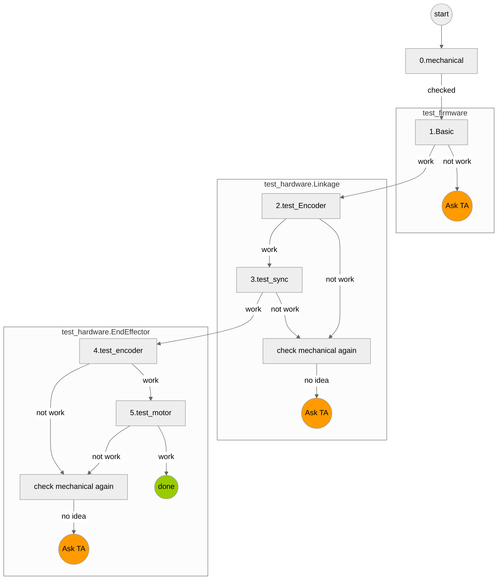
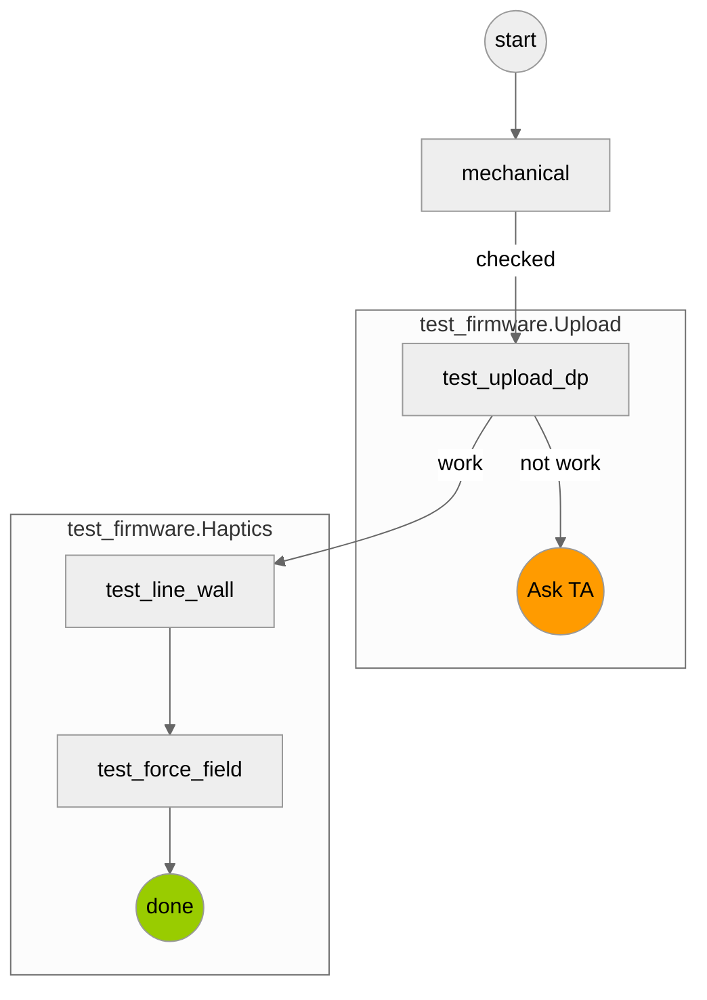
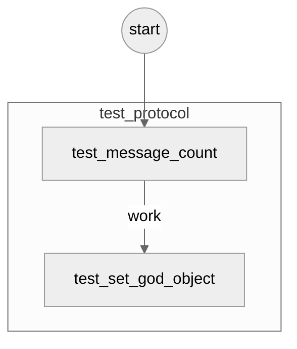

# Dualpanto Testing

Goal of this repository is to provide some (semi) automatic testing for the dualpanto platform. This involves basic functionality checks of the hardware, the firmware and potentially the unity integration

## Requirements
### Install the ESP32 driver
- [Download](https://www.silabs.com/developers/usb-to-uart-bridge-vcp-drivers?tab=downloads) the installer for your OS-Version.
- Run the installer.

### Install IDE
We recommend to use PyCharm to run the test flow.
#### PyCharm
1. download [PyCharm](https://www.jetbrains.com/community/education/#students)
2. clone this repo and open it with pycharm
3. [create vertial environment (we use python 3.7)](https://www.jetbrains.com/help/pycharm/creating-virtual-environment.html)and [install package using requirements.txt](https://www.jetbrains.com/help/pycharm/managing-dependencies.html)
4. install [Mermaid](https://plugins.jetbrains.com/plugin/20146-mermaid) plugin for flowchart vis
5. follow Test Flow section

you can run  unittest from Markdown preview (or [execute unittest from scripts](https://www.jetbrains.com/help/pycharm/testing-your-first-python-application.html#create-test))

[//]: # (![pycharm_unittest]&#40;resources/images/pycharm_unittest_1.jpg&#41;)

#### VScode
1. download [VScode](https://code.visualstudio.com/)
2. clone this repo and open it with VScode
3. [set venv and install package using requirements.txt](https://code.visualstudio.com/docs/python/environments)
4. follow Test Flow section

#### Command Line
you can also run all unittest from command line interface if you want.

# Test Flow
If you don't have any intuition about where the trouble that you have comes from,
you want to test from bottom up: mechanical -> hardware ->  framework -> communication ->unity. 

Some of the test is not software automatable, since they are related to haptics and mechanics. check `How to test?` link.

## Configurate test flow
1. go `config.py` and enter your EPS port.
2. check flag
3. when you upload a firmware, you need to push button back of dualpanto. please check [here](
).

## 1. Mechanical and Hardware
test with  IDE or from command line
0. [check mechanical configuration](CheckLists/mechanical.md)
1. `python -m unittest test_firmware.Basic`
2. `python -m unittest test_hardware.Linkage.test_encoder`[How to test?]()
3. `python -m unittest test_hardware.Linkage.test_sync`[How to test?]()
4. `python -m unittest test_hardware.EndEffector.test_encoder`[How to test?]()
5. `python -m unittest test_hardware.EndEffector.test_motor`[How to test?]()

check platformIO

## 2. Firmware
**WIP**

test with  IDE or from command line
0. [check mechanical configuration](CheckLists/mechanical.md)
1. `python -m unittest test_firmware.Upload.test_upload_dp`
2. 

## 3. Communication between DualPanto and PC
test with  IDE or from command line
1. `python -m unittest test_hardware.HardwareTest.test_compile_firmware` [How to test?]()

Please clone the current panto firmware into `firmware/10 panto firmware` and run `npm run script config`

On a firmware level we need to test that the dualpanto can
- perform the handshake
- keep the connection alive
- move the handles if instructed
- report the handle position
- accept obstacles
- render obstacles

## 4. Unity (Communication between DualPanto and Unity)

TODO

## Development
This project is currenty under developement. For questions, please reach out to martin.taraz@hpi.de