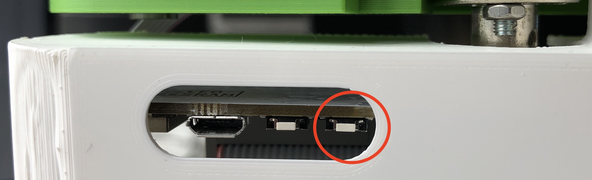
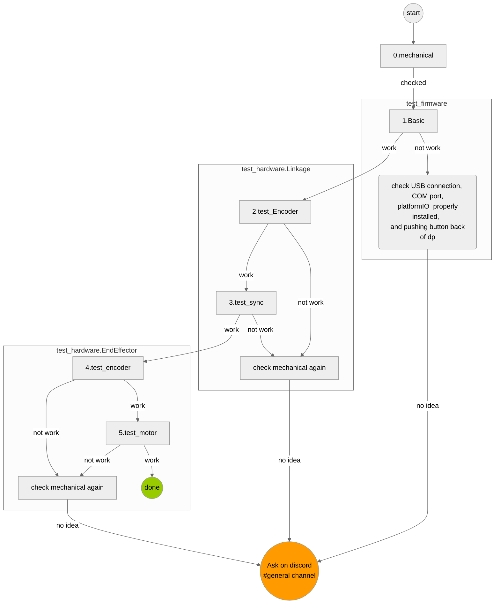

# Dualpanto Testing

The goal of this repository is to provide semi-automatic testing for the dualpanto device. This involves basic functionality checks of the hardware, the haptic rendering, communication protocol and the unity integration.

This project is work-in-progress. Welcome to contribute.
### For BIS participants
Please check [BIS.md](BIS/BIS.md) first.

## Requirements
### Install the ESP32 driver
- [Download](https://www.silabs.com/developers/usb-to-uart-bridge-vcp-drivers?tab=downloads) the latest installer for your OS-Version.
- Run the installer.

### Install IDE
We highly recommend to use PyCharm to run this test flow.
#### PyCharm
1. download [PyCharm](https://www.jetbrains.com/community/education/#students)
2. clone this repo and open it with pycharm
3. [create vertial environment (we use python 3.7)](https://www.jetbrains.com/help/pycharm/creating-virtual-environment.html)and [install package using requirements.txt](https://www.jetbrains.com/help/pycharm/managing-dependencies.html)
4. install [Mermaid](https://plugins.jetbrains.com/plugin/20146-mermaid) plugin for flowchart vis
5. follow Test Flow section

you can run  unittest from Markdown preview 

or [execute unittest from scripts](https://www.jetbrains.com/help/pycharm/testing-your-first-python-application.html#create-test)
#### VScode
1. download [VScode](https://code.visualstudio.com/)
2. clone this repo and open it with VScode
3. [set venv and install package using requirements.txt](https://code.visualstudio.com/docs/python/environments)
4. follow Test Flow section ([Test flow in VSCode](https://code.visualstudio.com/docs/python/testing))

#### Command Line
you can also run all unittest from command line interface if struggle with setting up IDE.

# Test Flow
Most of the test is not semi-automated since they are related to haptics and mechanical issue. Check `How to test?`.

**When you need to ask question on discord, please tell us which test you failed first, and describe error or issue you have precise as possible.**

## Configurate test flow

1. open `config.py` and enter your COM port to connect dualpanto.
2. All test upload a firmware for each unit-test. You probably need to push button back of dualpantowhen you upload a firmware (it depends on OS).

   
## 1. Mechanical and Hardware

0.  [check mechanical configuration](physical_test%2Fmechanical_issue_check_list.md)
1. `python -m unittest test_firmware.Basic`
2. `python -m unittest test_hardware.Linkage.test_encoder`[How to test?]()
3. `python -m unittest test_hardware.Linkage.test_sync`[How to test?]()
4. `python -m unittest test_hardware.EndEffector.test_encoder` **WIP**
5. `python -m unittest test_hardware.EndEffector.test_motor` **WIP**

- *1.Basic* check whether you could compile firmware and upload firmaere with platfiormIO
- *2.Linkage.test_encoder* check the four encoders on top of big motors works fine
- *3.Linkage.test_sync* check the four big motors works fine
- *4.EndEffector.test_encoder* check the two encoders on end effectors works fine
- *5.EndEffector.test_sync* check the two motors on end effectors works fine

## 2. Rendering Haptics = DualPanto Firmware

0. [check mechanical configuration](physical_test/mechanical.md)
1. `python -m unittest test_firmware.Haptics.test_line_wall` [How to test?]()
2. `python -m unittest test_firmware.Kinematics.test_kinematics_sync` **WIP**
3. `python -m unittest test_firmware.Haptics.test_force_field` **WIP**
4. `python -m unittest test_firmware.Haptics.test_rail` **WIP**
5. `python -m unittest test_firmware.Haptics.test_rectangle_obstacle` **WIP**
6. `python -m unittest test_firmware.Haptics.test_diamond_obstacle` **WIP**
7. `python -m unittest test_firmware.Haptics.test_moving_obstacle` **WIP**

- *1.Haptics.test_line_wall* check dualpanto firmware can render simplest wall = line or not
- *2.Kinematics.test_kiematics_sync* check forward and inverse kinematics of dualpanto firmware works fine or not

## 3. Communication between DualPanto and PC

**WIP**

## 4. Unity (Communication between DualPanto and Unity)

**WIP**

## Development
This project is currenty under developement. 
For questions, please reach out to martin.taraz@hpi.de, shohei.katakura@hpi.de

For BIS students, please reach out shohei.katakura@hpi.de